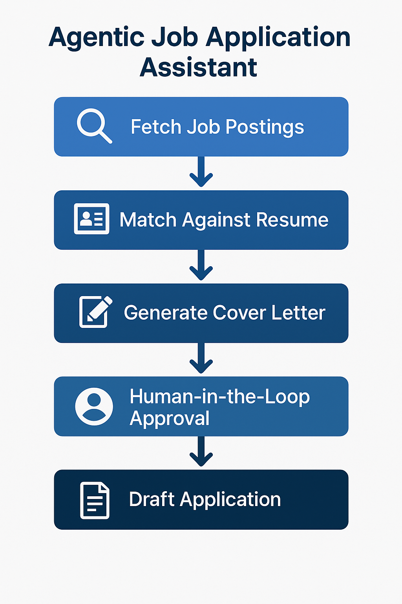

# 🤖 Agentic Job Application Assistant
*A multi-agent AI system that autonomously finds, ranks, and drafts job applications based on a user’s skills, salary, and location preferences.*

---

## 🧩 Overview

This project demonstrates how **agentic systems** can automate professional tasks by combining **LLMs**, **semantic search**, and **workflow orchestration**.

The system uses a set of cooperative agents to:
1. **Fetch** job postings (via API or local data)
2. **Match** them semantically against the user’s resume and preferences
3. **Generate** personalized cover letters using LLM reasoning
4. **(Optionally)** prepare draft applications for review

> ⚙️ This project is a **conceptual prototype** to demonstrate AI system design—not a production automation tool.

---

## 🧭 Workflow Overview

Below is a high-level visualization of how the **Agentic Job Application Assistant** operates:



1. **Fetch Job Postings** – Collects roles from APIs or local JSON data.  
2. **Match Against Resume** – Uses semantic embeddings to compare skills and relevance.  
3. **Generate Cover Letter** – Drafts tailored letters using GPT-based reasoning.  
4. **Human-in-the-Loop Approval** – You review before any submission.  
5. **Draft Application** – Outputs finalized text for manual or automated use.


---

## 🧠 Architecture

```mermaid
graph TD
A[Job APIs / Scrapers] --> B[Fetcher Agent]
B --> C[Embedding + Resume Matcher]
C --> D[LLM Cover Letter Generator]
D --> E[Human-in-the-Loop Approval]
E --> F[Application Draft (Submitter Agent)]
F --> G[Logs + Dashboard]

subgraph Local Data
resume.txt
jobs.json
end
```

---

## 🧩 Tech Stack

| Category | Tools |
|-----------|-------|
| **LLM** | OpenAI GPT-4o / GPT-4o mini |
| **Embeddings** | `text-embedding-3-large` + FAISS |
| **Agent Framework** | LangChain / CrewAI |
| **Automation (Optional)** | Playwright (mocked for demo) |
| **Interface** | Streamlit dashboard (optional) |
| **Data** | JSON / SQLite |

---

## 🧱 Project Structure

```
job-agentic-system/
├── README.md
├── main.py
├── agents/
│   ├── fetcher.py
│   ├── matcher.py
│   ├── writer.py
│   └── submitter.py
├── sample_data/
│   ├── jobs.json
│   └── resume.txt
├── notebooks/
│   └── similarity_demo.ipynb
└── requirements.txt
```

---

## ⚙️ Example Workflow

```bash
python main.py --resume sample_data/resume.txt --jobs sample_data/jobs.json
```

Output example:

```
[MatchAgent] 12 jobs found in target range
[ScoreAgent] Top Match: "AI Engineer – Regeneron" (0.91 similarity)
[WriterAgent] Generated personalized cover letter draft.
[SubmitterAgent] Draft ready for review in /drafts/regeneron_letter.txt
```

---

## 🧪 Core Concepts Demonstrated

- 🧠 **Agentic orchestration**: Multiple reasoning and tool-using components working in sequence.  
- 🔍 **Semantic matching**: Embedding similarity between job postings and resume content.  
- ✍️ **Generative writing**: Dynamic cover letter generation via GPT-4o.  
- 🧩 **Human-in-the-loop safety**: All applications require final confirmation.  
- 🧱 **Modular architecture**: Extendable to other domains (e.g., lead generation, grant writing).  

---

## 🧠 Example Code Snippet

```python
# matcher.py
from openai import OpenAI
import faiss, numpy as np

client = OpenAI()
def embed_text(text): 
    resp = client.embeddings.create(model="text-embedding-3-large", input=text)
    return np.array(resp.data[0].embedding, dtype="float32")

def rank_jobs(resume, jobs):
    resume_vec = embed_text(resume)
    job_vecs = [embed_text(job["description"]) for job in jobs]
    index = faiss.IndexFlatIP(len(resume_vec))
    index.add(np.vstack(job_vecs))
    scores, idx = index.search(np.array([resume_vec]), len(jobs))
    return [(jobs[i]["title"], float(scores[0][n])) for n, i in enumerate(idx[0])]
```

---

## 🚀 Future Enhancements

- ✅ Integrate **real job APIs** (LinkedIn, Greenhouse)
- ✅ Add **salary & location filters**
- ✅ Deploy **Streamlit dashboard** for review
- ✅ Integrate **Playwright** for semi-automated submissions
- ✅ Add **ML scoring model** trained on historical success data

---

## 📜 License
MIT License © 2025 John G. Shultz

---

## 🧩 About the Author
**John G. Shultz** — Senior Web & AI Developer exploring agentic and data-driven systems.  
- GitHub: [https://github.com/boobootoo2](https://github.com/boobootoo2)  
- LinkedIn: [https://www.linkedin.com/in/jackshultz/](https://www.linkedin.com/in/jackshultz/)  

*This project bridges full-stack automation, LLM reasoning, and data engineering—demonstrating end-to-end AI system design.*
